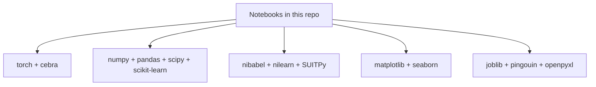

# xCEBRA-Time

This repository contains notebooks for running xCEBRA-based analyses and figure generation for schizophrenia time-series experiments. 
See our manuscript: "An explainable AI latent space of brain dynamics reveals a cerebello-prefrontal signature of schizophrenia symptoms"
Moritz Bonhoeffer, Paolo Muratore, Mackenzie Weygandt Mathis & Indrit Bègue.

## Repository contents

- `xCEBRA_combined.ipynb` — main xCEBRA workflow.
- `Ensemble_xCEBRA_models.ipynb` — ensemble modeling workflow.
- `Decode_clinical_variables_different_decoders.ipynb` — decoder comparison for clinical variables.
- `Data_Pipeline_for_publishing/` — preprocessing and atlas/time-course preparation notebooks.
- `Plotting_for_figures/` — plotting notebooks and generated figures.


## Easy run instructions

### Option A: Run locally with Python

1. Create and activate a virtual environment:
   - `python -m venv .venv`
   - `source .venv/bin/activate` (Linux/macOS) or `.venv\\Scripts\\activate` (Windows)
2. Install dependencies (see below):
   - `pip install -r requirements.txt`
3. Start Jupyter:
   - `jupyter notebook`
4. Open notebooks in this recommended order:
   - `Data_Pipeline_for_publishing/*.ipynb`
   - `xCEBRA_combined.ipynb`
   - `Ensemble_xCEBRA_models.ipynb`
   - `Decode_clinical_variables_different_decoders.ipynb`
   - `Plotting_for_figures/*.ipynb`

### Option B: Run with Docker

1. Build:
   - `docker build -t xcebra-schizophrenia .`
2. Run:
   - `docker run --rm -p 8888:8888 -v "$PWD":/workspace xcebra-schizophrenia`
3. Open Jupyter in your browser at the URL shown in the container output.

## Required Software Stack

Install all dependencies:

```bash
pip install -r requirements.txt
```

Primary runtime stack:

- Python 3.10
- PyTorch (`torch`)
- CEBRA (`cebra`)
- Scientific stack: `numpy`, `pandas`, `scipy`, `scikit-learn`
- Neuroimaging stack: `nibabel`, `nilearn`, `SUITPy`
- Plotting: `matplotlib`, `seaborn`
- Utilities used in notebooks: `joblib`, `pingouin`, `openpyxl`
- Notebook tools: `notebook`, `ipykernel`


### Dependency graph



## View notebooks with Jupyter Book

This repo includes Jupyter Book configuration files:

- `_config.yml`
- `_toc.yml`

To build and serve the book locally:

1. Install Jupyter Book:
   - `pip install jupyter-book`
2. Build the site from the repository root:
   - `jupyter-book build .`
3. Open:
   - `_build/html/index.html`

